# Memoria técnica · Expediente X

## Datos del proyecto

| Dato | Información |
| --- | --- |
| Proyecto | Archivo de episodios y casos de Expediente X |
| Módulo | 7 · Frontend con React |
| Formación | Máster Rock The Code · The Power Tech School |
| Autora | Araceli Fradejas Muñoz |
| Tecnologías principales | React, React Router, Vite, Node.js, Express y MongoDB Atlas |
| Web | [Mi archivo de Expediente X](https://xfiles-archive.vercel.app/) |
| API | [Comprobación de disponibilidad](https://xfiles-archive.vercel.app/api/health) |
| Repositorio público | [RTC-PROYECTO11-REACT-BASIC](https://github.com/AraceliFradejas/RTC-PROYECTO11-REACT-BASIC) |
| Código de la interfaz | [frontend](frontend) |
| Código del servidor | [backend](backend) |
| Inicio del desarrollo | 20 de septiembre de 2026 |
| Revisión y capturas de producción | 25 de septiembre de 2026 |

> En esta memoria explico el desarrollo real de mi proyecto, las decisiones que he tomado y los resultados comprobados. Distingo las pruebas automáticas, las consultas a los servicios y los recorridos manuales. Incluyo las dieciséis capturas de la revisión de producción y dos anteriores, identificadas como evolución del desarrollo.

## Contenido

- [1. Contexto y motivación](#1-contexto-y-motivación)
- [2. Objetivos](#2-objetivos)
- [3. Requisitos y cumplimiento](#3-requisitos-y-cumplimiento)
- [4. Tecnologías](#4-tecnologías)
- [5. Arquitectura](#5-arquitectura)
- [6. Flujo de la aplicación](#6-flujo-de-la-aplicación)
- [7. Datos y normalización](#7-datos-y-normalización)
- [8. Gestión de errores y comportamiento responsable](#8-gestión-de-errores-y-comportamiento-responsable)
- [9. Pruebas](#9-pruebas)
- [10. Resultados](#10-resultados)
- [11. Evolución del desarrollo](#11-evolución-del-desarrollo)
- [12. Evidencias](#12-evidencias)
  - [Recorrido de escritorio](#recorrido-principal-en-escritorio)
  - [Pruebas en móvil](#comprobaciones-complementarias-en-móvil)
  - [Pruebas en tableta](#comprobaciones-complementarias-en-tableta)
- [13. Dificultades y decisiones](#13-dificultades-y-decisiones)
- [14. Qué he aprendido](#14-qué-he-aprendido)
- [15. Posibles mejoras](#15-posibles-mejoras)
- [16. Ampliación del proyecto](#16-ampliación-del-proyecto)
- [17. Conclusión](#17-conclusión)

## 1. Contexto y motivación

Después de dedicar varios proyectos al universo swiftie y de conectar una interfaz con una API en KelseTS Talks, he querido trabajar React desde otra afición que forma parte de mi vida: Expediente X.

Mi hermano me habló de Anasazi un verano. Después llegaron los VHS, las guías y mis primeras búsquedas por Internet en la sala de informática de la UCM. También recuerdo las madrugadas grabando episodios y la novena temporada que vi en un canal alemán por satélite. Allí era Akte X: de ese recuerdo nace el tercer idioma de la aplicación.

He convertido esa motivación en un archivo de investigación con carpetas, sellos, tonos oscuros e ilustraciones propias del proyecto. Quería que buscar un episodio, abrir su ficha y guardar un favorito tuviera relación con la idea de abrir un expediente.

En [Mi historia](docs/MI-HISTORIA.md) conservo el relato completo. Lo he incorporado también a la web, junto con los créditos y el carácter académico, independiente y no oficial del proyecto.

## 2. Objetivos

Mi objetivo principal ha sido aplicar JSX, componentes, props, estados, efectos y navegación a una aplicación que permita:

- explorar un catálogo real y buscar episodios por título;
- combinar temporada y estado de visionado;
- abrir una ficha mediante su identificador en la ruta;
- guardar favoritos y registrar episodios vistos;
- mantener esas preferencias al recargar el navegador;
- revelar la sinopsis solo cuando quiera leerla;
- descubrir un episodio al azar dentro de los resultados filtrados;
- consultar la disponibilidad por país con fuente y fecha;
- utilizar la interfaz en español, inglés y alemán;
- navegar desde móvil, tableta y escritorio.

Como objetivos técnicos me propuse separar responsabilidades, compartir los estados que necesitan varias páginas, gestionar las peticiones y documentar el funcionamiento con evidencias. He ampliado el mínimo del ejercicio con una API propia, MongoDB Atlas, Cloudinary y una sección de películas.

## 3. Requisitos y cumplimiento

| Requisito | Cómo lo he implementado | Evidencia o alcance |
| --- | --- | --- |
| Componentes y props | `EpisodeCard` recibe `episode`; `Artwork` recibe `asset`; reutilizo `RequestState`. | `frontend/src/components`. |
| Tres estados útiles | Búsqueda, temporada, visionado, favoritos, idioma, país y sinopsis visible. | `Archive`, `PreferencesProvider` y `Detail`. |
| `useEffect` | Consulto datos, cancelo peticiones, guardo preferencias y actualizo el idioma del documento. | `useApi` y `PreferencesProvider`. |
| Petición real a una API | React hace `fetch` a Express; consulto Atlas y TMDB en el servidor. | Catálogo, detalle, películas y plataformas comprobados en producción. |
| React Router y enlaces | Utilizo `BrowserRouter`, `Routes`, `Link` y `NavLink`. | `main.jsx` y `Layout`. |
| Parámetro de ruta utilizado | Leo `id` con `useParams` y consulto `/api/episodes/:id`. | `/expedientes/283988` corresponde a «Piloto». |
| HTML semántico y accesibilidad | Utilizo `header`, `nav`, `main`, `footer`, etiquetas y enlace para saltar al contenido. | Implementado; he comprobado salto al contenido, enlace al archivo y selector por teclado. No es una auditoría completa. |
| Diseño responsive | Adapto portada, navegación, filtros y cuadrículas con CSS. | 16 capturas actuales con muestras a 390, 768 y 1440 píxeles; alcance en la galería. |
| GitHub público y Vercel | Publico interfaz y API bajo el mismo dominio. | Visibilidad y respuestas HTTP comprobadas el 25/09/2026. |

La correspondencia detallada con el enunciado está en [Mi comprobación del enunciado](docs/COMPROBACION-ENUNCIADO.md). La entrega académica solicita el enlace al repositorio público; la web y esta memoria permiten revisar el resultado y su funcionamiento.

## 4. Tecnologías

### React, React Router y Vite

He utilizado React para componer las pantallas y actualizar la interfaz desde el estado. React Router declara las rutas y permite navegar mediante enlaces. Vite proporciona el servidor de desarrollo, el proxy local de `/api` y la compilación de producción. Utilizo Node.js 22.12 o superior y conservo las versiones exactas en `package-lock.json`.

### Node.js, Express, MongoDB Atlas y Mongoose

He creado una API Express que sirve los episodios almacenados en Atlas y consulta TMDB para películas y plataformas. Mongoose define el modelo de episodio y sus traducciones. Separo la aplicación Express del arranque local para reutilizarla en Vercel.

### CSS, imágenes y Cloudinary

He trabajado el diseño con CSS, puntos de adaptación, foco visible y preferencia de movimiento reducido. Cloudinary sirve las ilustraciones y mantengo copias WebP locales como respaldo. El manifiesto de imágenes conserva las dimensiones y las direcciones públicas.

### Fuentes, pruebas y despliegue

Utilizo TMDB como fuente del catálogo, películas y traducciones, y los datos de JustWatch distribuidos por TMDB para las plataformas. Compruebo el backend con `node:test` y Supertest, compilo con Vite y reviso el formato con Prettier. Publico la aplicación y su API en Vercel.

## 5. Arquitectura

He organizado el repositorio en espacios de trabajo npm para `frontend` y `backend`. Utilizo React, Vite y React Router en la interfaz; Express, Mongoose y MongoDB Atlas en el servidor. Las versiones quedan recogidas en `package-lock.json`.

```text
frontend/src/
  components/   Tarjetas, imágenes, estructura y mensajes de petición
  context/      Idioma, país, favoritos y progreso
  hooks/        Peticiones y cancelación
  pages/        Pantallas y rutas
  content/      Historia y manifiesto de imágenes
  i18n.js       Textos de interfaz en ES, EN y DE
  styles.css    Estilos y adaptación responsive
backend/src/
  models/       Modelo de episodio
  services/     Catálogo, cliente TMDB, plataformas y películas
  app.js        API Express
  db.js         Conexión a Atlas
  server.js     Arranque local
api/index.js    Entrada del backend en Vercel
```

Mi flujo de datos es **React → Express → Atlas o TMDB**. Importo los episodios de TMDB en Atlas. Las películas y plataformas se consultan en TMDB con una caché temporal de una hora. Las imágenes se sirven desde Cloudinary con respaldo local.

Mantengo los secretos en archivos `.env` ignorados y en variables privadas de Vercel. No utilizo variables `VITE_` para credenciales. `Solucion/` y sus variantes quedan excluidas de Git y del despliegue.

### Componentes, props y páginas

He separado las páginas de las piezas que reutilizo. `EpisodeCard` recibe `episode` para representar cada expediente; `Artwork` recibe el recurso visual; `RequestState` presenta el estado de la consulta. La misma página `Archive` sirve para el catálogo y para favoritos mediante `onlyFavorites`. Así puedo mantener la búsqueda y los filtros en un único lugar.

### Estados con una finalidad real

| Estado | Dónde lo utilizo | Qué cambia en la interfaz |
| --- | --- | --- |
| `query` | `Archive` | El texto por el que filtro los títulos. |
| `season` | `Archive` | La temporada seleccionada. |
| `viewing` | `Archive` | Todos, vistos o pendientes. |
| `favorites` | `PreferencesProvider` | Los botones de favorito y la selección guardada. |
| `watched` | `PreferencesProvider` | Los episodios vistos y el progreso. |
| `language` | `PreferencesProvider` | Los textos y las consultas localizadas. |
| `country` | `PreferencesProvider` | El país de disponibilidad. |
| `revealed` | Detalle | La visibilidad de la sinopsis. |
| `result` y `attempt` | `useApi` | La carga del recurso y su reintento. |

No guardo una segunda lista para cada combinación de filtros. Obtengo los resultados a partir del catálogo y de los valores elegidos; el botón aleatorio utiliza esa misma selección.

### Efectos y peticiones

En el archivo combino búsqueda por título, temporada y estado de visionado. Normalizo mayúsculas y acentos. La selección aleatoria utiliza los resultados filtrados; no elige episodios fuera de esa selección.

Guardo favoritos y episodios vistos en `localStorage`. `PreferencesProvider` comparte esos datos y valida los valores recuperados. Si el navegador impide guardarlos, muestro un aviso. El progreso cuenta únicamente episodios presentes en el catálogo. No he incluido cuentas ni sincronización entre dispositivos.

En el detalle leo el parámetro de ruta, cargo el episodio y mantengo la sinopsis oculta inicialmente. Los botones comunican su estado con `aria-pressed` y `aria-expanded`. Identifico la ilustración como imagen de temporada, sin presentarla como un fotograma del episodio.

`useApi` distingue carga, éxito, error y recurso inexistente. Cancelo la petición con `AbortController` al cambiar de recurso o abandonar la vista. Ofrezco reintento y evito mostrar datos de una petición anterior mientras cambia la ruta consultada.

Al navegar, `Layout` devuelve el foco al contenido principal y desplaza la página al inicio. Actualizo `lang` y el título del documento según el idioma elegido.

## 6. Flujo de la aplicación

```text
Abrir la portada
  ↓
Entrar en el archivo y cargar el catálogo desde mi API
  ↓
Buscar un título y combinar filtros
  ↓
Abrir /expedientes/:id
  ↓
Consultar la ficha y decidir si revelar la sinopsis
  ↓
Marcar favorito o visto y conservarlo en el navegador
  ↓
Volver a Favoritos y consultar el progreso
```

Puedo visitar Dónde verla de forma independiente, elegir país y cambiar el idioma sin modificar ese país. Personajes, películas y Mi historia completan la navegación desde la estructura compartida.

### Rutas y contratos de consulta

| Ruta de interfaz | Función |
| --- | --- |
| `/` | Portada y entradas al archivo. |
| `/expedientes` | Catálogo, búsqueda, filtros y selección aleatoria. |
| `/expedientes/:id` | Ficha, favoritos, visionado y sinopsis. |
| `/favoritos` | Selección guardada en este navegador. |
| `/personajes` | Mulder y Scully. |
| `/peliculas` y `/peliculas/:id` | Las dos películas y sus fichas. |
| `/donde-ver` | Consulta de disponibilidad por país. |
| `/mi-historia` | Motivación, recursos y atribuciones. |
| Cualquier otra ruta | Página de recurso no encontrado. |

| Petición GET | Respuesta |
| --- | --- |
| `/api/health` | Estado del servidor y conexión a la base. |
| `/api/episodes?lang=es` | Catálogo localizado; admite `es`, `en` y `de`. |
| `/api/episodes/:id?lang=es` | Episodio por identificador de TMDB. |
| `/api/movies?lang=es` | Películas `846` y `8836`. |
| `/api/movies/:id?lang=es` | Detalle de una de esas películas. |
| `/api/watch-providers?country=ES` | Ofertas para `ES`, `DE`, `GB` o `US`. |

Valido idioma, país e identificadores. Distingo parámetros inválidos, catálogo indisponible, recurso inexistente y fallo de la fuente. Mis pruebas HTTP utilizan datos aislados; no escriben en el catálogo real.

## 7. Datos y normalización

### Modelo de episodio

| Campo | Contenido | Decisión |
| --- | --- | --- |
| `tmdbId` | Identificador numérico único | Lo utilizo en importación y consulta del detalle. |
| `season` y `number` | Temporada y número de episodio | Ordenan y sitúan cada expediente. |
| `airDate` | Fecha de emisión | Conservo el dato de la fuente. |
| `translations` | Título y sinopsis en ES, EN y DE | La versión inglesa es obligatoria en el modelo. |
| `sourceUrl` | Enlace a la fuente | Mantengo la procedencia del registro. |
| `image` | URL, identificador, autor, fuente y licencia | Reservo la información de recursos visuales asociados. |
| `createdAt` y `updatedAt` | Marcas temporales de Mongoose | Registro la creación y actualización del documento. |

He definido un índice único para `tmdbId` y otro por temporada y número. El modelo admite temporada cero, pero el importador del catálogo actual excluye los especiales. Los identificadores que guardo en favoritos y vistos se relacionan con estos episodios; esas preferencias permanecen en el navegador y no crean documentos de usuario en Atlas.

### Importación, traducciones y disponibilidad

He elegido TMDB como fuente principal por su catálogo y traducciones. En la fase inicial exploré TVmaze; conservo ese antecedente en el historial, sin presentarlo como la integración actual.

El importador comprueba la serie `4087`, excluye especiales, une traducciones por identificador y limita la escritura a `expediente_x`. Actualizo por identificador de TMDB para evitar duplicados y conservo recursos visuales propios. La escritura por lotes no es una transacción: puedo repetir la importación para completar un fallo parcial.

Mantengo independientes el idioma de la interfaz y el país de disponibilidad. Puedo leer en alemán y consultar España. Si falta una traducción del catálogo, identifico por separado el idioma disponible del título y de la sinopsis. La presencia de texto no equivale a una revisión lingüística completa.

En «Dónde verla» muestro modalidad, país, fuente y fecha de consulta. Los datos proceden de JustWatch mediante TMDB. No deduzco idiomas de audio, subtítulos ni disponibilidad de todas las temporadas a partir de ofertas generales. Tampoco confundo una consulta sin ofertas con un error del servicio.

## 8. Gestión de errores y comportamiento responsable

He distinguido los estados de carga, éxito, recurso inexistente y error en el cliente. Al cambiar de ruta o idioma cancelo la petición anterior y evito presentar un resultado que pertenezca a otra consulta. El reintento permite volver a solicitar los datos.

En el servidor valido idiomas, países e identificadores antes de resolver la petición. Diferencio una entrada inválida, un episodio inexistente y una base no disponible. Una consulta de plataformas sin ofertas tampoco equivale a un fallo de TMDB. Las pruebas automatizadas comprueban estos contratos con datos aislados.

Valido las preferencias recuperadas de `localStorage` y muestro un aviso si no puedo conservarlas. Los favoritos no implican una cuenta: borrar los datos del navegador elimina esa selección y no existe sincronización entre dispositivos.

He utilizado `header`, `nav`, `main` y `footer`, etiquetas para los controles, enlace para saltar al contenido y foco visible. Los botones de marcado comunican su estado con `aria-pressed` y la sinopsis con `aria-expanded`. Documento el recorrido de teclado que he comprobado en la sección de pruebas.

Las credenciales quedan en archivos ignorados y variables privadas del servidor. Las ilustraciones se identifican como generadas con IA, y mantengo las atribuciones de TMDB y JustWatch. No deduzco doblaje, subtítulos o condiciones de contratación de una lista general de plataformas.

## 9. Pruebas

### Comandos y alcance

```bash
npm test
npm run build
npm run format:check
```

El 25 de septiembre de 2026 he comprobado las quince pruebas del backend, la compilación y el formato, también después de corregir el contador singular. El comando de formato revisa los directorios definidos en `package.json`; no es una prueba de funcionamiento ni una revisión de los documentos Markdown.

Las pruebas están en `backend/test/`, separadas en contratos de API, TMDB, películas y entrada serverless. Utilizan datos aislados y no modifican los 218 episodios de producción. No dispongo de una suite automatizada del frontend.

### Integraciones y comprobaciones en producción

| Comprobación | Resultado observado |
| --- | --- |
| `npm test` | 15 pruebas correctas. El aislamiento bloqueaba los puertos de Supertest; al ejecutar con permiso, pasan las 15. |
| `npm run build` | Compilación de producción correcta. |
| `npm run format:check` | Todos los archivos incluidos cumplen el formato. |
| GitHub | La consulta pública confirma `visibility: public` y rama `main`. |
| `/api/health` en Vercel | HTTP 200, `status: ok`, `database: connected`. |
| Catálogo en ES, EN y DE | HTTP 200 y 218 episodios de 11 temporadas en cada respuesta. |
| Detalle de `283988` en español | HTTP 200; devuelve «Piloto», temporada 1, episodio 1. |
| Películas en español | HTTP 200; devuelve las películas `846` y `8836`. |
| Plataformas ES, DE, GB y US | HTTP 200, país correcto, ofertas y fecha de consulta. |
| Nueve rutas de interfaz | HTTP 200 y HTML en inicio, archivo, detalle, favoritos, personajes, películas, detalle de película, disponibilidad e historia. |
| Portada en Chrome | He observado la página renderizada y su imagen principal en escritorio. |

Las comprobaciones HTTP de rutas acreditan que Vercel sirve la aplicación al abrir esas direcciones. No sustituyen la comprobación de cada interacción en el navegador. Las pruebas automatizadas cubren el backend; no dispongo de una suite automatizada de interfaz.

### Recorridos manuales

| Comprobación | Resultado observado |
| --- | --- |
| Búsqueda de «Anasazi» | Obtengo un resultado; también encuentro el episodio usando minúsculas. Al borrar el texto recupero los 218 episodios. |
| Temporada 2 | El botón visual aplica la temporada; el selector de escritorio devuelve 25 episodios. |
| Selección aleatoria filtrada | Con «Anasazi» y temporada 2, el botón abre /expedientes/285317. Esta prueba verifica un conjunto de un resultado; no es una prueba estadística del azar. |
| Favorito y visionado | Marco Anasazi como favorito y visto. Recargo la ficha; ambos estados permanecen activos. |
| Sinopsis | Está oculta al abrir la ficha. La revelo y vuelvo a ocultarla. |
| Favoritos | Consulto la selección guardada y observo Anasazi, con progreso 1 / 218. |
| Vistos y pendientes | Visto devuelve el episodio; Pendientes devuelve cero resultados y su mensaje. |
| Retirada de datos de prueba | Desmarco visto y favorito. Tras recargar, favoritos permanece vacío y el progreso vuelve a 0 / 218. |
| Idioma independiente del país | ES/España → DE/España; recargo y conservo ambos. Después DE/Alemania → EN/Alemania → ES/Alemania. Finalmente restablezco España. |
| Disponibilidad | Observo ofertas y modalidades para España y Alemania, con fuente y fecha. No verifico reproducción, audio ni condiciones de contratación. |
| Teclado | Desde la barra de direcciones uso Tab hasta «Saltar al contenido», compruebo el foco visible, pulso Enter y Tab hasta «Abrir el archivo» y navego con Enter. Selecciono temporada 2 mediante flechas y Enter. |
| Películas | Observo las dos fichas del listado y abro la primera desde su enlace; aparece /peliculas/846 con datos reales. |
| Ruta inexistente | /ruta-de-prueba-inexistente muestra la página 404 de la interfaz. No implica un estado HTTP 404 de la SPA. |
| Diseño | Reviso las páginas capturadas a 390, 768 y 1440 píxeles de ancho. No observo contenido principal cortado en esas capturas. |

He retirado el favorito y el marcado de prueba al terminar; he recargado y comprobado favoritos vacío y progreso 0 / 218. He dejado el idioma en español y el país en España.

### Límites de la revisión

He comprobado muestras en Chrome mediante emulación responsive, no en dispositivos físicos. No he recorrido todas las combinaciones de idioma, página y tamaño. La prueba de teclado no constituye una auditoría completa de accesibilidad. No he simulado fallos de red o almacenamiento en esta revisión manual ni he probado la reproducción en las plataformas externas.

## 10. Resultados

| Área | Resultado comprobado | Alcance |
| --- | --- | --- |
| Catálogo | 218 episodios y 11 temporadas | Respuesta de la API en los tres idiomas. |
| React | Búsqueda, filtros, detalles y preferencias | Código y recorridos manuales documentados. |
| Persistencia | Favoritos y vistos se conservan al recargar | Navegador utilizado en la revisión. |
| Idiomas y país | Preferencias independientes | Recorrido ES/España → DE/España → EN/Alemania. |
| Plataformas | Respuestas para ES, DE, GB y US | Ofertas de la fuente en la fecha consultada. |
| Películas | Dos fichas y detalle de la primera | API real y navegación a `/peliculas/846`. |
| Imágenes | 35 recursos subidos a Cloudinary | Copias WebP y respaldo local documentados. |
| Publicación | GitHub público y web/API en Vercel | Conexión a Atlas y rutas comprobadas. |
| Validación | 15 pruebas, compilación y formato correctos | Backend automatizado; interfaz revisada manualmente. |
| Documentación visual | 16 capturas actuales y 2 históricas | Incluidas y comentadas en esta memoria. |
| Entrega en campus | Pendiente de enviar el enlace | No la doy por realizada. |

## 11. Evolución del desarrollo

| Etapa | Trabajo realizado | Resultado |
| --- | --- | --- |
| Concepto y motivación | Definí el archivo a partir de mi historia con la serie. | Temática confirmada e interfaz ES/EN/DE. |
| Base React | Preparé estructura, páginas, estados, efectos y rutas. | Navegación y presentación de estados de consulta. |
| Catálogo real | Exploré fuentes y elegí TMDB; conecté Atlas e importé datos. | 218 episodios en 11 temporadas. |
| Consulta personal | Añadí búsqueda, filtros, favoritos, progreso y sinopsis. | Preferencias persistentes en el navegador. |
| Identidad visual | Preparé ilustraciones, WebP, manifiesto y Cloudinary. | Recursos optimizados y respaldo local. |
| Ampliaciones | Incorporé plataformas, personajes y películas. | Archivo conectado con consultas complementarias. |
| Publicación y revisión | Conecté Vercel, comprobé la API y recorrí la web. | Evidencias del 25 de septiembre de 2026. |
| Corrección posterior | Ajusté el singular del contador en ES/EN/DE. | «1 expediente», «1 case file» y «1 Fallakte». |

Conservo el registro de los pasos y comprobaciones anteriores en [Historial de desarrollo](docs/HISTORIAL-DESARROLLO.md). Estas dos imágenes anteriores muestran etapas del trabajo y no representan la apariencia actual.

<details>
<summary>Primera interfaz alemana sin catálogo · Captura histórica</summary>

Esta captura histórica recoge la presentación en alemán cuando el catálogo todavía no estaba disponible. Me permite explicar que el mensaje de indisponibilidad formaba parte del desarrollo antes de completar la conexión; no la utilizo como evidencia de un error actual en producción.

<a href="docs/screenshots/inicio/archivo-movil-de.png"></a>

</details>

<details>
<summary>Primera ficha de Piloto · Captura histórica</summary>

Conservo la ficha móvil de Piloto, con favorito y visionado, anterior a la integración visual definitiva. La comparo con la ficha actual de Anasazi para mostrar la evolución del contenido y de las ilustraciones sin sustituir las pruebas recientes por capturas antiguas.

<a href="docs/screenshots/detalle-piloto.png">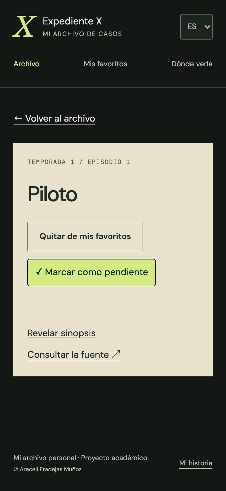</a>

</details>

## 12. Evidencias

He tomado las siguientes dieciséis capturas de la aplicación publicada el **25 de septiembre de 2026**. Son páginas completas exportadas desde Chrome, sin retocar su contenido. Indico el área de visualización en píxeles CSS; los PNG tienen densidad 2 y una altura variable según la longitud de la página. Por ejemplo, el área de escritorio de 1440 × 900 píxeles CSS produce un PNG de 2880 píxeles de ancho y una altura que recoge toda la página.

La [galería original](docs/screenshots/entrega-2026-09-25/README.md) conserva las dimensiones exactas de cada archivo. Aquí explico cada evidencia junto a su imagen para que pueda revisarse sin salir de la memoria.

Las capturas son anteriores a la corrección de concordancia del contador. Por eso puede aparecer «1 expedientes» aunque el código publicado ya utiliza el singular. He conservado los originales y he documentado la corrección; no he alterado las imágenes para ocultarla.

Presento primero el recorrido de **escritorio**, con siete capturas de portada, archivo, personajes, películas, historia y ruta inexistente. Después reúno las pruebas de **móvil y tableta** como evidencias complementarias del diseño responsive, la persistencia y los idiomas.

Las imágenes de escritorio aprovechan el ancho del documento. Muestro las de móvil a 340 píxeles y las de tableta a 600 píxeles para conservar una lectura proporcionada. Estos tamaños de presentación no modifican los archivos ni el área de visualización utilizada en las pruebas; puedo abrir cada imagen para consultar el original completo.

- [Recorrido principal en escritorio](#recorrido-principal-en-escritorio)
- [Comprobaciones complementarias en móvil](#comprobaciones-complementarias-en-móvil)
- [Comprobaciones complementarias en tableta](#comprobaciones-complementarias-en-tableta)

| Evidencia | Pantalla | Idioma y área de visualización |
| --- | --- | --- |
| 12.1 | [Portada en escritorio](#121-portada-en-escritorio) | ES · 1440 × 900 |
| 12.2 | [Archivo y temporada 2](#122-archivo-y-temporada-2) | ES · 1440 × 900 |
| 12.3 | [Mulder y Scully](#123-mulder-y-scully) | ES · 1440 × 900 |
| 12.4 | [Las dos películas](#124-las-dos-películas) | ES · 1440 × 900 |
| 12.5 | [Detalle de la primera película](#125-detalle-de-la-primera-película) | ES · 1440 × 900 |
| 12.6 | [Mi historia y atribuciones](#126-mi-historia-y-atribuciones) | ES · 1440 × 900 |
| 12.7 | [Ruta inexistente](#127-ruta-inexistente) | ES · 1440 × 900 |
| 12.8 | [Portada en móvil](#128-portada-en-móvil) | ES · 390 × 844 |
| 12.9 | [Búsqueda de Anasazi](#129-búsqueda-de-anasazi) | ES · 390 × 844 |
| 12.10 | [Detalle, persistencia y sinopsis](#1210-detalle-persistencia-y-sinopsis) | ES · 390 × 844 |
| 12.11 | [Favoritos y progreso en móvil](#1211-favoritos-y-progreso-en-móvil) | ES · 390 × 844 |
| 12.12 | [Filtro de episodios vistos en tableta](#1212-filtro-de-episodios-vistos-en-tableta) | ES · 768 × 1024 |
| 12.13 | [Filtro sin resultados](#1213-filtro-sin-resultados) | ES · 768 × 1024 |
| 12.14 | [Disponibilidad en España](#1214-disponibilidad-en-españa) | ES · 768 × 1024 |
| 12.15 | [Akte X con España seleccionada](#1215-akte-x-con-españa-seleccionada) | DE · 768 × 1024 |
| 12.16 | [The X-Files con Alemania seleccionada](#1216-the-x-files-con-alemania-seleccionada) | EN · 768 × 1024 |

### Recorrido principal en escritorio

He organizado estas siete pantallas como una visita al archivo publicado, desde la portada hasta sus contenidos y la respuesta ante una ruta inexistente.

#### 12.1. Portada en escritorio

**ES · 1440 × 900 píxeles CSS · Producción · 25/09/2026.**

He revisado la portada en escritorio, con la composición de imagen y texto y los accesos a las distintas secciones. La comparo con la evidencia móvil 12.8 para comprobar la adaptación de la jerarquía visual. También he probado un recorrido de teclado: Tab hasta Saltar al contenido, Enter, Tab hasta Abrir el archivo y Enter para navegar; esa interacción está registrada como prueba manual, no se deduce de la imagen estática.


#### 12.2. Archivo y temporada 2

**ES · 1440 × 900 píxeles CSS · Producción · 25/09/2026.**

He seleccionado la temporada 2 y he obtenido 25 episodios. La captura completa permite revisar las tarjetas y la continuidad del catálogo. He probado tanto el acceso visual de temporadas como el selector, este último también con flechas y Enter. Al combinar temporada 2 con Anasazi, la selección aleatoria ha abierto `/expedientes/285317`; esta prueba comprueba un conjunto de un resultado, no la distribución estadística del azar.

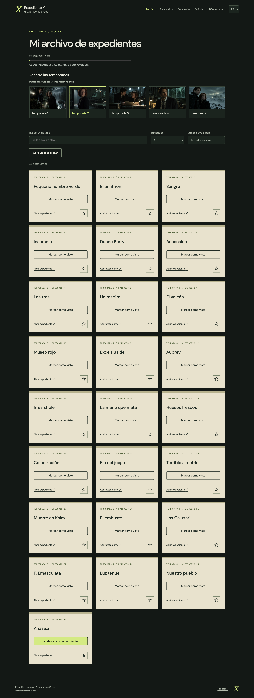

#### 12.3. Mulder y Scully

**ES · 1440 × 900 píxeles CSS · Producción · 25/09/2026.**

He abierto la sección de personajes y he revisado la presentación de Mulder y Scully, sus retratos y el contenido editorial. Las ilustraciones forman parte de la identidad que he preparado para la web y se identifican como recursos generados con IA. No las presento como fotografías oficiales ni como datos procedentes del catálogo de episodios.

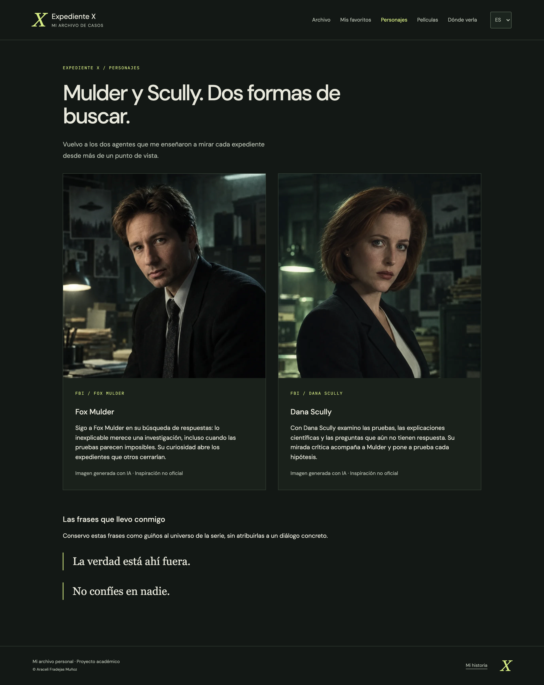

#### 12.4. Las dos películas

**ES · 1440 × 900 píxeles CSS · Producción · 25/09/2026.**

He abierto el listado de películas y he observado las dos fichas de 1998 y 2008. Esta sección amplía el archivo sin mezclar películas con episodios: el progreso sigue teniendo como referencia los 218 episodios. Los datos de las películas llegan de TMDB a través de mi API y sus tarjetas enlazan con la ficha correspondiente.

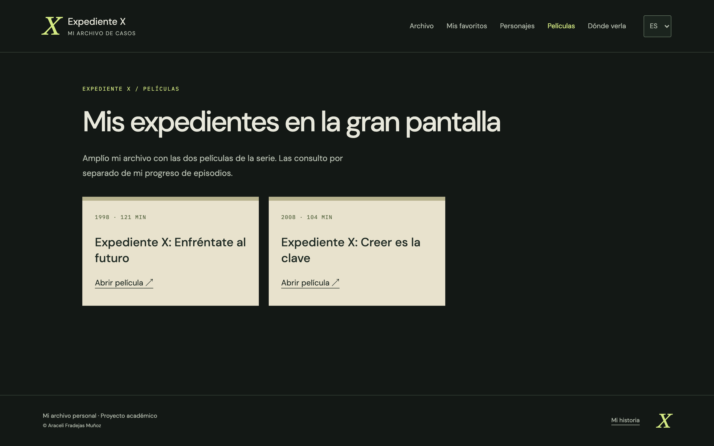

#### 12.5. Detalle de la primera película

**ES · 1440 × 900 píxeles CSS · Producción · 25/09/2026.**

He pulsado el enlace de la primera película y he accedido a `/peliculas/846`. He comprobado los datos reales de 1998 y 121 minutos. La ficha dispone de sinopsis ocultable y enlace a la fuente. Este segundo detalle reutiliza la idea de ruta con parámetro, con un recurso y una consulta distintos de los episodios.

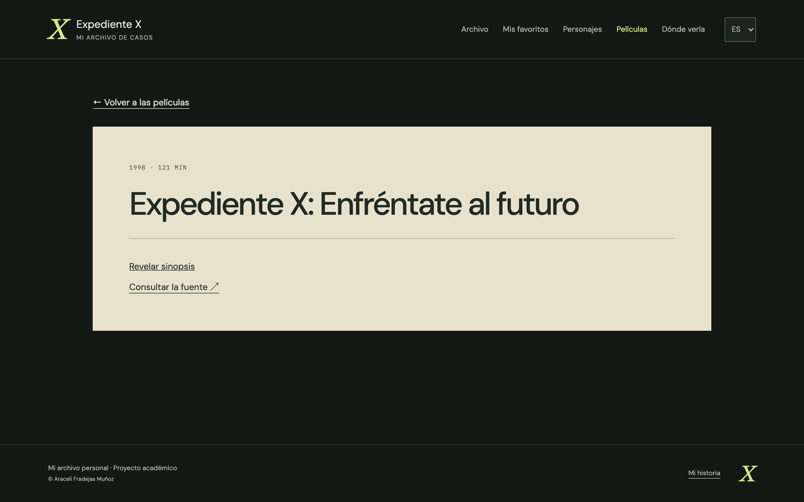

#### 12.6. Mi historia y atribuciones

**ES · 1440 × 900 píxeles CSS · Producción · 25/09/2026.**

He recorrido la página completa de Mi historia para revisar el relato personal, sus ilustraciones y las atribuciones. La imagen permite comprobar que el proyecto explica su motivación y la procedencia de datos y recursos. La escena del tren es una interpretación visual de ficción, no una fotografía de mi vida.

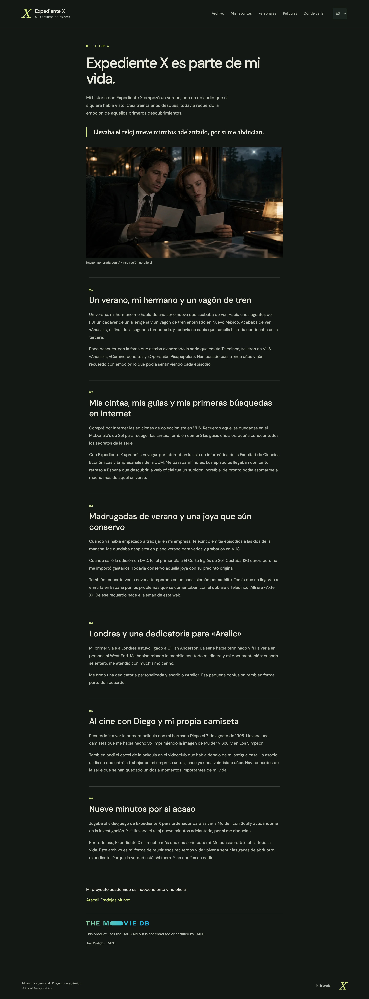

#### 12.7. Ruta inexistente

**ES · 1440 × 900 píxeles CSS · Producción · 25/09/2026.**

He abierto directamente `/ruta-de-prueba-inexistente` y he observado la página de recurso no encontrado de la interfaz. La ruta comodín evita dejar una pantalla vacía y ofrece una salida de navegación. Esta evidencia corresponde al mensaje 404 de React; la reescritura de la SPA puede devolver HTTP 200 y no presento la imagen como prueba de un estado HTTP 404.

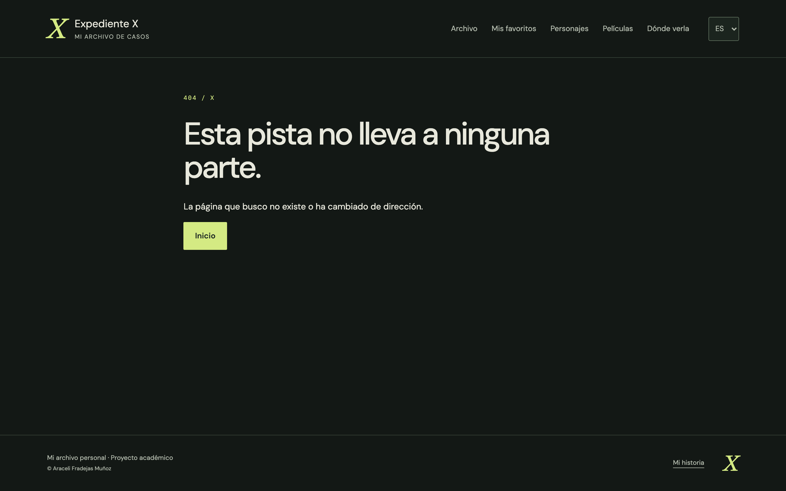

### Comprobaciones complementarias en móvil

Estas cuatro capturas muestran cómo adapto la consulta a una pantalla estrecha y cómo conservo las preferencias. Complementan la presentación principal de escritorio.

#### 12.8. Portada en móvil

**ES · 390 × 844 píxeles CSS · Producción · 25/09/2026.**

He abierto la portada a tamaño móvil. La imagen principal, el título, la navegación y los accesos al archivo se distribuyen en vertical. Esta captura permite revisar la lectura de la entrada y su continuidad hasta el pie de página. La comparo con la portada de escritorio de la evidencia 12.1 para mostrar cómo cambia la composición.

<a href="docs/screenshots/entrega-2026-09-25/01-portada-movil-es.png">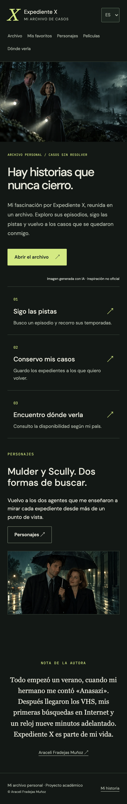</a>

#### 12.9. Búsqueda de Anasazi

**ES · 390 × 844 píxeles CSS · Producción · 25/09/2026.**

He escrito «Anasazi» en el buscador y he obtenido un único expediente. También he comprobado la búsqueda en minúsculas y, al borrar el texto, he recuperado los 218 episodios. La imagen recoge el resultado antes de marcarlo como favorito o visto. Esta prueba relaciona el estado del campo de búsqueda con la lista renderizada.

<a href="docs/screenshots/entrega-2026-09-25/02-busqueda-anasazi-movil-es.png">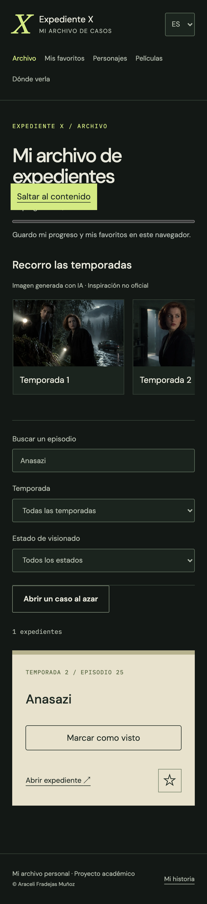</a>

#### 12.10. Detalle, persistencia y sinopsis

**ES · 390 × 844 píxeles CSS · Producción · 25/09/2026.**

He abierto `/expedientes/285317`, correspondiente a Anasazi, temporada 2, episodio 25. Lo he marcado como favorito y visto y he recargado la página: ambos estados permanecen activos. Después he revelado la sinopsis que inicialmente estaba oculta; también he comprobado que puedo volver a ocultarla. La captura recoge la ficha con la sinopsis visible. El parámetro de la ruta determina el episodio consultado.

<a href="docs/screenshots/entrega-2026-09-25/03-anasazi-persistencia-sinopsis-movil-es.png">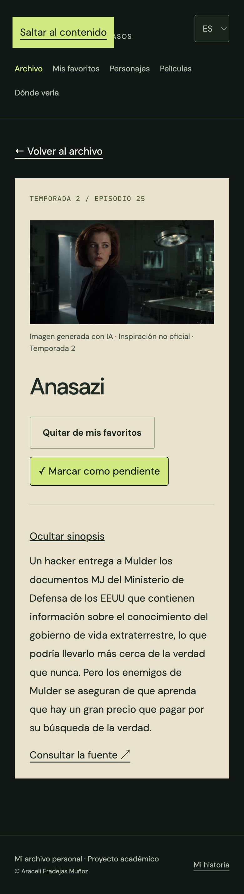</a>

#### 12.11. Favoritos y progreso en móvil

**ES · 390 × 844 píxeles CSS · Producción · 25/09/2026.**

He entrado en Favoritos después de guardar Anasazi. La tarjeta aparece en la selección y el progreso muestra 1 / 218. Reutilizo la página del archivo con la prop `onlyFavorites`, de modo que la tarjeta y los filtros mantienen el mismo comportamiento. El progreso corresponde al catálogo completo, no al número de favoritos.

<a href="docs/screenshots/entrega-2026-09-25/04-favoritos-progreso-movil-es.png">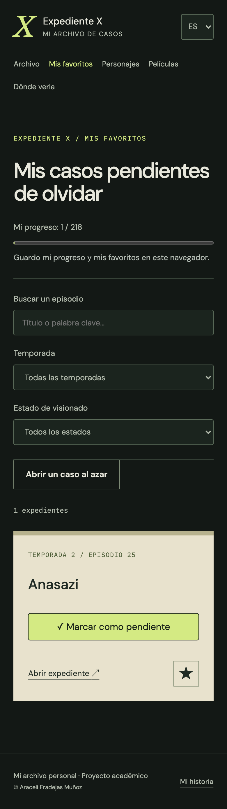</a>

### Comprobaciones complementarias en tableta

Estas cinco capturas recogen filtros, resultados vacíos y disponibilidad en tres idiomas a un ancho intermedio.

#### 12.12. Filtro de episodios vistos en tableta

**ES · 768 × 1024 píxeles CSS · Producción · 25/09/2026.**

He mantenido Anasazi como favorito y visto y he seleccionado el filtro Visto. El episodio sigue apareciendo. La captura muestra la combinación de selección guardada y filtro de visionado en un ancho intermedio. Compruebo así que cambiar el filtro no elimina las preferencias guardadas.

<a href="docs/screenshots/entrega-2026-09-25/05-favoritos-vistos-tableta-es.png">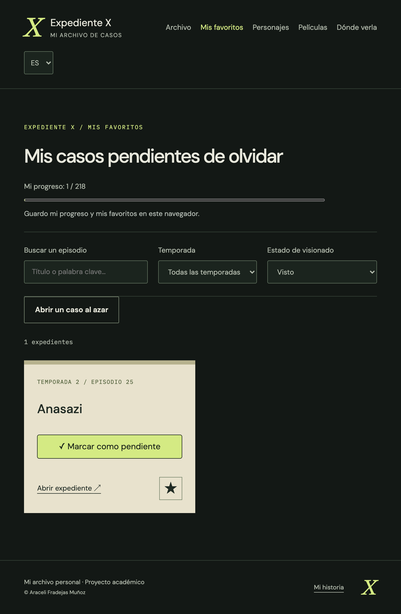</a>

#### 12.13. Filtro sin resultados

**ES · 768 × 1024 píxeles CSS · Producción · 25/09/2026.**

En la misma selección he cambiado a Pendientes. Como el único favorito ya estaba visto, obtengo cero resultados. Muestro un mensaje específico y no ofrezco la selección aleatoria de un conjunto vacío. Es un resultado válido de los filtros, distinto de un error al consultar la API.

<a href="docs/screenshots/entrega-2026-09-25/06-filtro-sin-resultados-tableta-es.png">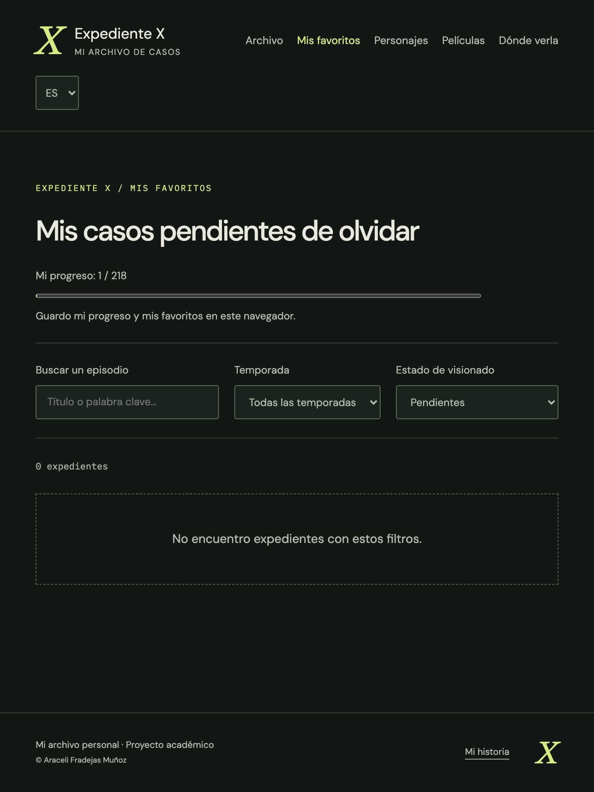</a>

#### 12.14. Disponibilidad en España

**ES · 768 × 1024 píxeles CSS · Producción · 25/09/2026.**

He consultado España en Dónde verla y he observado las ofertas agrupadas por modalidad, junto a la fuente y la fecha de consulta. Esta imagen acredita la respuesta que mostraba la aplicación el 25 de septiembre de 2026. No convierte esas ofertas en una disponibilidad permanente ni acredita reproducción, audio o subtítulos.

<a href="docs/screenshots/entrega-2026-09-25/07-disponibilidad-espana-tableta-es.png">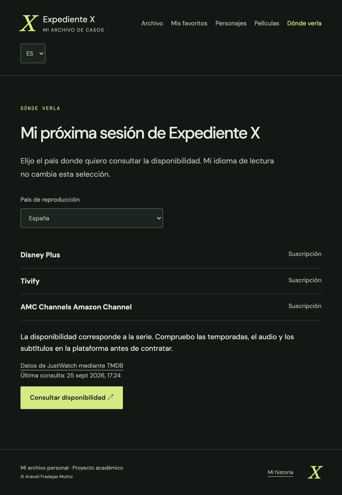</a>

#### 12.15. Akte X con España seleccionada

**DE · 768 × 1024 píxeles CSS · Producción · 25/09/2026.**

He cambiado el idioma de español a alemán sin modificar España y he recargado. Se conservan ambas preferencias: la interfaz utiliza Akte X y la consulta sigue correspondiendo al país elegido. Esta prueba demuestra por qué he separado `language` y `country` en el contexto de preferencias.

<a href="docs/screenshots/entrega-2026-09-25/08-aleman-pais-espana-tableta.png">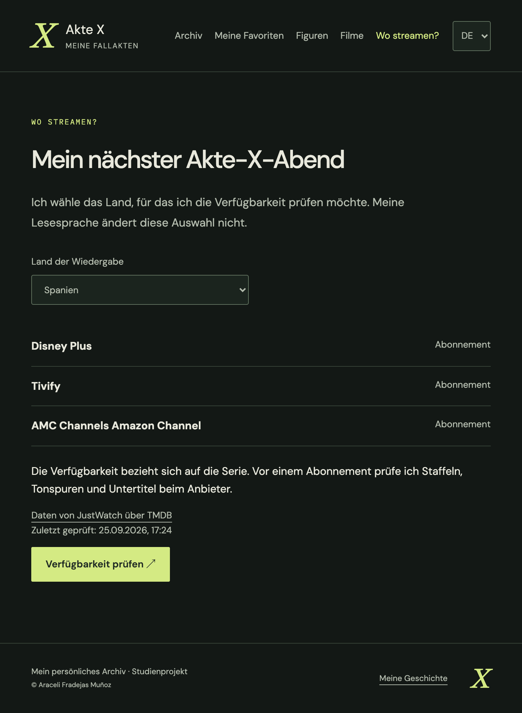</a>

#### 12.16. The X-Files con Alemania seleccionada

**EN · 768 × 1024 píxeles CSS · Producción · 25/09/2026.**

Desde la interfaz alemana he seleccionado Alemania y después he cambiado a inglés. El país permanece en Alemania mientras cambian los textos de la interfaz a The X-Files. He continuado el recorrido hacia español manteniendo Alemania y, al terminar, he restablecido España. No utilizo el idioma como indicador del país de reproducción.

<a href="docs/screenshots/entrega-2026-09-25/09-ingles-pais-alemania-tableta.png">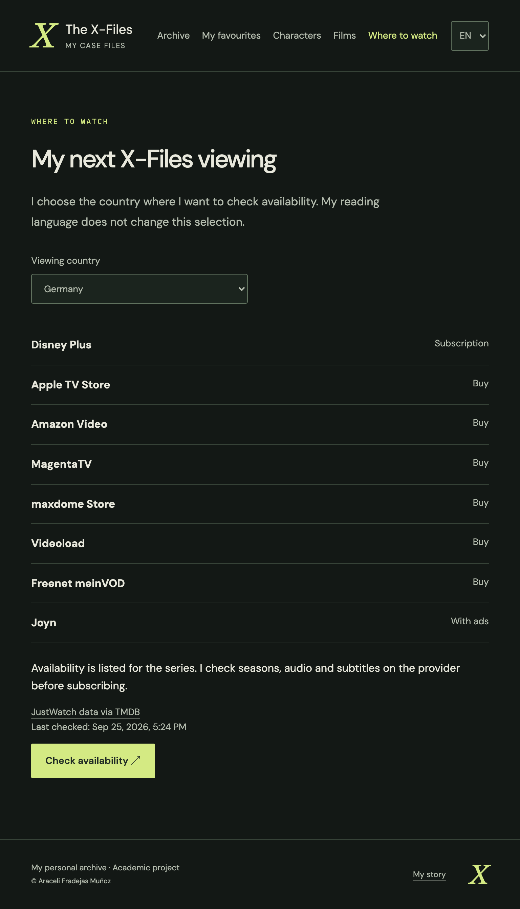</a>

## 13. Dificultades y decisiones

### Compartir preferencias sin duplicar lógica

Favoritos y vistos intervienen en las tarjetas, el detalle y el progreso. He situado esos estados en `PreferencesProvider` para que todas las pantallas trabajen sobre los mismos valores. Mantengo la búsqueda y los filtros en el archivo porque su función pertenece a esa vista. Esta separación me permite razonar sobre qué estado necesita cada componente.

### Distinguir idioma y país

Mi recuerdo de Akte X justificaba el alemán, pero no que una persona que lee en alemán consulte siempre Alemania. He separado ambas preferencias y he comprobado su persistencia. También distingo la traducción de la interfaz de las traducciones disponibles en la fuente del catálogo.

### Cambiar de recurso durante una petición

Una respuesta puede llegar después de cambiar de página o idioma. En `useApi` he incluido cancelación y asociación del resultado con la ruta consultada. Así el detalle no muestra temporalmente información del expediente anterior como si perteneciera al nuevo.

### Importar sin perder recursos propios

He utilizado el identificador de TMDB para actualizar episodios sin duplicarlos y he separado los campos importados de las imágenes propias. Valido la descarga antes de escribir y limito la base de destino. La escritura por lotes no es transaccional; he documentado esa limitación y la posibilidad de repetir el proceso.

### Preparar imágenes para la web

He pasado de 67.615.527 bytes de PNG originales a 2.745.710 bytes de copias WebP, aproximadamente un 96 % menos. Mantengo los originales fuera de Git y del despliegue. Registro dimensiones, cargo de forma diferida los recursos secundarios y conservo respaldo local para las imágenes remotas.

La primera subida a Cloudinary encontró un problema de permisos. Lo resolví con una asignación temporal de Master Admin y la retiré después de subir los 35 recursos. La visualización pública utiliza sus URL y no requiere esa autorización. Documento el proceso en [Mis imágenes](docs/IMAGENES.md).

### Separar desarrollo local y publicación

Utilizo Node.js 22.12 o superior. Ejecuto `npm ci` y preparo `backend/.env` siguiendo [Configuración local](docs/CONFIGURACION.md). Arranco ambas aplicaciones con `npm run dev`; abro la interfaz en `http://127.0.0.1:5173`. Vite redirige `/api` al puerto `3001` del backend.

En Vercel utilizo el proyecto `xfiles`, el dominio `xfiles-archive.vercel.app`, `npm run build` y la carpeta `frontend/dist`. Las reescrituras sirven las rutas de React y la función de `api/index.js` bajo el mismo dominio. El backend reutiliza la conexión a Atlas.

He configurado `MONGODB_URI` y `TMDB_READ_TOKEN` como secretos de producción. La configuración documentada de Atlas permite conexiones desde `0.0.0.0/0` para admitir Vercel, con autenticación obligatoria. Las credenciales de Cloudinary se utilizan en el script local de subida; no son necesarias para mostrar sus imágenes públicas.

### Revisar estados pequeños y documentar el resultado

La prueba de búsqueda devolvió un solo expediente y dejó visible un error de concordancia. He corregido el contador en los tres idiomas y he mantenido las capturas originales con una nota sobre su fecha. Una revisión útil incluye resultados vacíos y singulares, además del catálogo completo.

## 14. Qué he aprendido

He aprendido a pensar la interfaz como el resultado de unos datos y unos estados: al cambiar una búsqueda, temporada o preferencia, React actualiza los componentes que dependen de ella. Las props me permiten reutilizar tarjetas y páginas sin repetir su estructura.

También he practicado la diferencia entre calcular una selección y realizar un efecto secundario. Filtrar el catálogo parte de datos que ya tengo; consultar una API, persistir preferencias o actualizar el idioma del documento necesita coordinación con el exterior del componente.

Las rutas con parámetros me han permitido conectar un enlace, un identificador, una petición y una ficha concreta. Abrir directamente esa dirección en Vercel me ha ayudado a comprender la relación entre la navegación de React y las reescrituras del servidor.

El trabajo con Atlas, TMDB y Cloudinary ha reforzado la separación entre datos, recursos visuales y secretos del servidor. He aprendido también a tratar la procedencia de los datos como parte del producto: país, fuente y fecha aportan contexto a una consulta de disponibilidad.

Finalmente, he aprendido a explicar lo que demuestra cada comprobación. Una captura muestra un estado visual; un recorrido manual acredita una interacción; una prueba automática verifica un comportamiento bajo unas condiciones concretas. Necesito las tres perspectivas para documentar con precisión el trabajo.

## 15. Posibles mejoras

- Añadir pruebas automatizadas del frontend para filtros, preferencias y cambios de ruta.
- Ampliar la revisión a dispositivos físicos y otros navegadores.
- Completar una revisión lingüística de los textos en los tres idiomas.
- Simular fallos de red y almacenamiento en la interfaz y documentar la recuperación.
- Ampliar los recorridos de teclado y las comprobaciones con lector de pantalla.
- Valorar exportar e importar favoritos sin exigir una cuenta de usuario.
- Repetir la consulta de disponibilidad cuando revise el proyecto, conservando su fecha.

Estas propuestas amplían el alcance comprobado. La entrega en el campus sigue siendo un paso independiente: tengo preparado el enlace público, pero no registro un envío que no he realizado.

## 16. Ampliación del proyecto

### Películas y personajes

He añadido las películas de 1998 y 2008 mediante `/peliculas` y `/peliculas/:id`. Las consulto desde el servidor con una caché de una hora y mantengo sus registros separados del catálogo de episodios. He incorporado una sección editorial dedicada a Mulder y Scully para completar la identidad del archivo.

### Disponibilidad por país

He conectado una consulta para España, Alemania, Reino Unido y Estados Unidos. Muestro ofertas por modalidad, fuente y fecha sin inferir idiomas de audio. Esta ampliación me ha permitido trabajar con una segunda selección persistente que no depende del idioma de la interfaz.

### Recursos e identidad visual

He utilizado una estética de archivo con verdes oscuros, documentos, sellos y guiños a la serie. He incorporado 35 imágenes generadas con IA, con copias WebP optimizadas y un manifiesto de dimensiones y URLs. Son interpretaciones de ficción, no fotografías ni fotogramas oficiales.

Sirvo las imágenes desde Cloudinary y utilizo copias locales si falla la carga remota. Conservo los PNG originales fuera de Git y del despliegue. Documento la preparación y subida en [Mis imágenes](docs/IMAGENES.md).

Mantengo el logotipo y el aviso de TMDB, además de la atribución a JustWatch. Reúno las fuentes en [Recursos y atribuciones](docs/RECURSOS.md). Este es un proyecto académico independiente y no oficial.

## 17. Conclusión

He desarrollado una aplicación React que permite explorar un catálogo real, abrir expedientes, guardar favoritos y seguir el visionado. He relacionado componentes, props, estados, efectos y rutas con funciones que puedo comprobar en la web publicada.

He conectado una API Express con MongoDB Atlas y TMDB, he preparado recursos visuales en Cloudinary y he publicado la interfaz y el servidor en Vercel. Acompaño el código de las comprobaciones técnicas, los recorridos manuales y las capturas comentadas de esta memoria.

El repositorio de entrega es público: [RTC-PROYECTO11-REACT-BASIC](https://github.com/AraceliFradejas/RTC-PROYECTO11-REACT-BASIC). Mantengo el seguimiento en [Revisión de entrega](docs/REVISION-ENTREGA.md), diferenciando el proyecto publicado del envío pendiente en el campus.

---

**Araceli Fradejas Muñoz**

Proyecto académico del máster Rock The Code · The Power Tech School.
