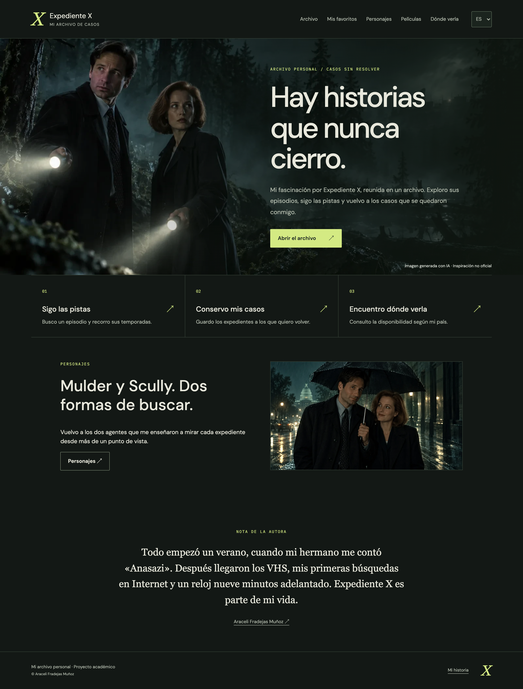

# Expediente X · Mi archivo de casos

Desarrollo este proyecto para el **Módulo 7: Frontend con React** del máster **Rock The Code**, de **The Power Tech School**.

> Mi punto de partida: convertir mi afición por Expediente X en un archivo que pueda explorar, consultar y hacer mío.

## Contenido

- [Una historia personal](#una-historia-personal)
- [Estado actual](#estado-actual)
- [Funcionalidades](#funcionalidades)
- [Tecnologías y fuentes](#tecnologías-y-fuentes)
- [Idiomas](#idiomas)
- [Desarrollo local y despliegue](#desarrollo-local-y-despliegue)
- [Documentación](#documentación)
- [Recursos y autoría](#recursos-y-autoría)

## Una historia personal

Siempre me ha encantado Expediente X. Después de dedicar varios proyectos de backend al universo swiftie, quiero explorar otra de mis aficiones y darle una identidad visual propia.

Mi hermano me descubrió «Anasazi» un verano. Después llegaron los VHS, mis primeras búsquedas por Internet en la UCM y muchos recuerdos que hoy reúno en [mi historia](docs/MI-HISTORIA.md).

Recuerdo haber visto la novena temporada en un canal alemán, donde la serie se titulaba **Akte X**. Ese recuerdo me ha llevado a plantear la aplicación en español, inglés y alemán.

Imagino la web como un archivo de investigación: carpetas, sellos, anotaciones y pequeños guiños a la serie. Quiero cuidar tanto la experiencia de consulta como el aprendizaje de React.

## Estado actual

**Ya consulto un catálogo real de 218 episodios y 11 temporadas.** He importado los datos de TMDB en MongoDB Atlas, con títulos y sinopsis disponibles en español, inglés y alemán. He conectado la pantalla de plataformas por país y he añadido favoritos, progreso de visionado y selección aleatoria entre los resultados filtrados.

He comprobado en desarrollo la lectura del catálogo, el detalle, la búsqueda, la persistencia del progreso y la consulta real de plataformas. La compilación y las quince pruebas del backend pasan. He conectado el backend en producción. He integrado mis imágenes generadas con IA y una sección de Mulder y Scully. He subido las 35 imágenes a Cloudinary y conservo copias optimizadas de respaldo.

Mi repositorio es [RTC-PROYECTO11-REACT-BASIC](https://github.com/AraceliFradejas/RTC-PROYECTO11-REACT-BASIC). Mi interfaz pública está en [XFiles Archive](https://xfiles-archive.vercel.app/). En la revisión del 25 de septiembre he vuelto a comprobar el repositorio público, las 15 pruebas, la compilación, el formato, el catálogo en los tres idiomas y las respuestas de plataformas para los cuatro países. He comprobado en producción la conexión a Atlas, los 218 episodios, el detalle y las plataformas de TMDB.

## Funcionalidades

- Exploro el catálogo de episodios con búsqueda y filtro por temporada.
- Consulto cada expediente en una página con su identificador en la ruta.
- Guardo favoritos y progreso de visionado en el navegador.
- Puedo ocultar o revelar las sinopsis para evitar spoilers.
- Descubro un episodio al azar.
- Consulto dónde ver la serie según el país seleccionado.
- Exploro como extra las dos películas, con sus fichas en tres idiomas.
- Utilizo la web en móvil, tableta y escritorio, con navegación por teclado y controles accesibles.

He implementado estas funciones. Guardo favoritos y episodios vistos en este navegador; no los sincronizo entre dispositivos. El caso aleatorio respeta mi búsqueda y los filtros de temporada y visionado. He comprobado los recorridos principales y he documentado muestras responsive de móvil, tableta y escritorio con [16 capturas actuales](docs/screenshots/entrega-2026-09-25/README.md). Reúno las comprobaciones y los pendientes en [Mi revisión de entrega](docs/REVISION-ENTREGA.md).

## Tecnologías y fuentes

| Tecnología | Para qué la utilizo |
| --- | --- |
| React y Vite | Construyo la interfaz con componentes, props, estados y efectos. |
| React Router | Organizo las páginas y la navegación, incluida la ruta `/expedientes/:id`. |
| CSS | Doy forma al archivo y adaptaré las pantallas a distintos tamaños. |
| Node.js y Express | Creo mi API y centralizo las consultas externas. |
| MongoDB Atlas y Mongoose | Guardo mi catálogo y contenido editorial con sus fuentes. |
| Cloudinary | Alojo recursos visuales propios o con permiso de reutilización. |
| TMDB | Consulto el catálogo, las traducciones disponibles y las plataformas. |

Utilizo **TMDB como fuente principal** y sus datos de JustWatch para consultar plataformas. Muestro país, modalidad y fecha de consulta, e incluyo las atribuciones en «Mi historia». He comprobado las respuestas reales para España, Alemania, Reino Unido y Estados Unidos.

Durante la exploración inicial también comprobé TVmaze: devolvió 218 registros de episodios en 11 temporadas. Mantengo esa comprobación en la memoria como antecedente, sin confundirla con una integración terminada de TMDB.

## Mis películas como contenido extra

He añadido `/peliculas` y `/peliculas/:id` para las películas de 1998 y 2008. Consulto sus datos en TMDB desde mi backend, con una caché de una hora, duración, traducciones, sinopsis ocultable y enlace a la fuente. Mantengo el progreso de visionado reservado a los episodios.

## Idiomas

He preparado las versiones **Expediente X**, **The X-Files** y **Akte X**, con navegación, controles, errores y textos accesibles traducidos. Identifico el idioma disponible cuando falta una traducción del catálogo; he comprobado el cambio de idioma y su independencia del país, sin presentar esa comprobación como una revisión lingüística exhaustiva.

Mantengo separado el idioma del país de reproducción: puedo leer la web en alemán y consultar la disponibilidad en España. No doy por confirmado el doblaje, los subtítulos o todas las temporadas a partir de la disponibilidad general de la serie.

## Desarrollo local y despliegue

Utilizo **Node.js 22.12 o superior**. Desde la raíz del repositorio ejecuto:

```bash
npm ci
npm run dev
```

Abro la interfaz en `http://127.0.0.1:5173` y la API en `http://127.0.0.1:3001/api/health`. Vite redirige las peticiones `/api` al backend durante el desarrollo. Si cambio el puerto del backend, actualizo también ese destino en `frontend/vite.config.js`.

Para conectar los servicios preparo `backend/.env` a partir de [mi plantilla](backend/.env.example). He documentado los pasos en [Configuración local](docs/CONFIGURACION.md). La aplicación puede arrancar sin credenciales; en ese caso no sirve el catálogo.

```bash
npm run build
npm test
npm run format:check
```

Con `TMDB_READ_TOKEN` configurado, reviso el catálogo sin escribir y después lo importo:

```bash
npm run catalog:preview
npm run catalog:import
```

La importación solo permite la base `expediente_x`, actualiza por identificador de TMDB y conserva los recursos visuales propios. He ejecutado la importación real: 218 episodios nuevos.

La compilación genera `frontend/dist`. Mantengo las credenciales en archivos locales ignorados por Git y en variables privadas del servidor.

He desplegado la interfaz en **Vercel**, vinculada a `main`, con el proyecto `xfiles` y el dominio `xfiles-archive.vercel.app`. He preparado una función en `api/index.js` para servir mi API bajo el mismo dominio y reutilizar la conexión a Atlas. He configurado `MONGODB_URI` y `TMDB_READ_TOKEN` como secretos de Production en Vercel. He autorizado la regla permanente `0.0.0.0/0` en Atlas para permitir las conexiones de Vercel; la autenticación de la base continúa siendo obligatoria.

## Documentación

- En [Mi comprobación del enunciado](docs/COMPROBACION-ENUNCIADO.md) relaciono cada requisito de entrega con su implementación y evidencia.

- En mi [memoria](MEMORIA.md) explico la motivación, los requisitos, las decisiones y el plan de validación.
- En [Mis imágenes](docs/IMAGENES.md) explico mi selección visual y la preparación de los archivos.
- En mi [registro de recursos](docs/RECURSOS.md) identifico fuentes y atribuciones.
- En mi [documento de concepto](docs/CONCEPTO.md) recojo la exploración inicial y el alcance previsto.

## Recursos y autoría

Soy **Araceli Fradejas Muñoz**, autora de este proyecto académico, independiente y no oficial. No tengo vinculación con los titulares de Expediente X ni presento los materiales de terceros como propios.

Registraré la procedencia, autoría y licencia de los recursos utilizados. Alojar una imagen en Cloudinary no sustituye su permiso de uso. Mantengo el material docente de referencia fuera de Git y GitHub.

### Mi revisión visual y funcional

He comprobado búsqueda, filtros, selección aleatoria, favoritos, progreso, sinopsis e independencia entre idioma y país. He revisado muestras a 390, 768 y 1440 píxeles de ancho en Chrome y conservo [16 capturas reales con fecha, tamaño y explicación](docs/screenshots/entrega-2026-09-25/README.md). La galería distingue observaciones, pruebas de teclado y límites de la revisión.



He corregido la concordancia del contador para mostrar «1 expediente», «1 case file» y «1 Fallakte». Las capturas conservan el estado anterior a esta corrección. El seguimiento de publicación y entrega está en [Mi revisión de entrega](docs/REVISION-ENTREGA.md).

### Fuentes técnicas

- [Condiciones y atribuciones de TMDB](https://developer.themoviedb.org/docs/faq).
- [Disponibilidad por país y atribución a JustWatch](https://developer.themoviedb.org/reference/tv-series-watch-providers).
- [Documentación de TVmaze](https://www.tvmaze.com/api).
- [Gestión de archivos en Cloudinary](https://cloudinary.com/documentation/upload_images).
