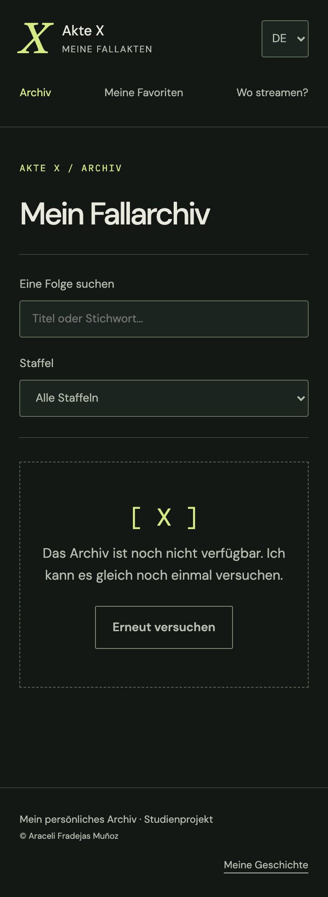

# Expediente X · Mi archivo de casos

Desarrollo este proyecto para el **Módulo 7: Frontend con React** del máster **Rock The Code**, de **The Power Tech School**.

> Mi punto de partida: convertir mi afición por Expediente X en un archivo que pueda explorar, consultar y hacer mío.

## Contenido

- [Una historia personal](#una-historia-personal)
- [Estado actual](#estado-actual)
- [Qué quiero construir](#qué-quiero-construir)
- [Tecnologías y fuentes](#tecnologías-y-fuentes)
- [Idiomas](#idiomas)
- [Desarrollo local y despliegue](#desarrollo-local-y-despliegue)
- [Documentación](#documentación)
- [Recursos y autoría](#recursos-y-autoría)

## Una historia personal

Siempre me ha encantado Expediente X. Después de dedicar varios proyectos de backend al universo swiftie, quiero explorar otra de mis aficiones y darle una identidad visual propia.

Recuerdo haber visto la octava temporada en un canal alemán, donde la serie se titulaba **Akte X**. Ese recuerdo me ha llevado a plantear la aplicación en español, inglés y alemán.

Imagino la web como un archivo de investigación: carpetas, sellos, anotaciones y pequeños guiños a la serie. Quiero cuidar tanto la experiencia de consulta como el aprendizaje de React.

## Estado actual

**He preparado la primera base ejecutable.** Tengo React y Express, navegación con React Router, interfaz en español, inglés y alemán, preferencias locales y un modelo de episodios para MongoDB. He comprobado la compilación y doce pruebas de la API y los servicios. He verificado la conexión a Atlas y el acceso a la base `expediente_x`, que todavía no contiene episodios. Tengo pendientes la importación desde TMDB, Cloudinary y el despliegue.

Puedo abrir el inicio y navegar por las pantallas. El catálogo muestra un aviso mientras no conecte la base de datos; la sección de plataformas está identificada como pendiente. No he validado todavía el recorrido completo con episodios reales.

Mi repositorio es [RTC-PROYECTO11-REACT-BASIC](https://github.com/AraceliFradejas/RTC-PROYECTO11-REACT-BASIC). Añadiré el enlace de la web cuando tenga un despliegue comprobado.

## Qué quiero construir

- Exploraré el catálogo de episodios con búsqueda y filtro por temporada.
- Consultaré cada expediente en una página con su identificador en la ruta.
- Guardaré favoritos y progreso de visionado en el navegador.
- Podré ocultar o revelar las sinopsis para evitar spoilers.
- Descubriré un episodio al azar.
- Consultaré dónde ver la serie según el país seleccionado.
- Utilizaré la web en móvil, tableta y escritorio, con navegación por teclado y controles accesibles.

Mantengo esta lista como alcance de la entrega. He preparado las pantallas y la lógica inicial de filtros, favoritos y sinopsis; tengo pendientes su validación con el catálogo real, el progreso de visionado y el expediente aleatorio.

## Tecnologías y fuentes

| Tecnología | Para qué la utilizaré |
| --- | --- |
| React y Vite | Construiré la interfaz con componentes, props, estados y efectos. |
| React Router | Organizaré las páginas y la navegación, incluida la ruta `/expedientes/:id`. |
| CSS | Daré forma al archivo y adaptaré las pantallas a distintos tamaños. |
| Node.js y Express | Crearé mi API y centralizaré las consultas externas. |
| MongoDB Atlas y Mongoose | Guardaré mi catálogo y contenido editorial con sus fuentes. |
| Cloudinary | Alojaré recursos visuales propios o con permiso de reutilización. |
| TMDB | Consultaré el catálogo, las traducciones disponibles y las plataformas. |

He elegido **TMDB como fuente principal prevista** por el alcance multilingüe. Para la disponibilidad utilizaré sus datos de JustWatch y aplicaré las atribuciones correspondientes. He implementado el importador y la consulta de plataformas en el backend. Tengo pendiente configurar el token y comprobar las respuestas reales para la serie.

Durante la exploración inicial también comprobé TVmaze: devolvió 218 registros de episodios en 11 temporadas. Mantengo esa comprobación en la memoria como antecedente, sin confundirla con una integración terminada de TMDB.

## Idiomas

Prepararé las versiones **Expediente X**, **The X-Files** y **Akte X**. Traduciré navegación, controles, errores y textos accesibles. Revisaré la cobertura de títulos y sinopsis; identificaré los contenidos que solo estén disponibles en otro idioma.

Separaré el idioma del país de reproducción: podré leer la web en alemán y consultar la disponibilidad en España. No daré por confirmado el doblaje, los subtítulos o todas las temporadas a partir de la disponibilidad general de la serie.

## Desarrollo local y despliegue

Utilizo **Node.js 22.12 o superior**. Desde la raíz del repositorio ejecuto:

```bash
npm ci
npm run dev
```

Abro la interfaz en `http://127.0.0.1:5173` y la API en `http://127.0.0.1:3001/api/health`. Vite redirige las peticiones `/api` al backend durante el desarrollo. Si cambio el puerto del backend, actualizo también ese destino en `frontend/vite.config.js`.

Para conectar los servicios preparo `backend/.env` a partir de [mi plantilla](backend/.env.example). He documentado los pasos en [Configuración local](docs/CONFIGURACION.md). La aplicación puede arrancar sin credenciales; en ese caso no sirve el catálogo.

```bash
npm run build
npm test
npm run format:check
```

Cuando complete `TMDB_READ_TOKEN`, revisaré el catálogo sin escribir y después lo importaré:

```bash
npm run catalog:preview
npm run catalog:import
```

La importación solo permite la base `expediente_x`, actualiza por identificador de TMDB y conserva los recursos visuales propios. Todavía no la he ejecutado con datos reales.

La compilación genera `frontend/dist`. Mantengo las credenciales en archivos locales ignorados por Git y en variables privadas del servidor.

Mi objetivo es desplegar en **Vercel**, verificar las rutas al recargar y entregar el repositorio público. Incorporaré enlaces y capturas cuando haya comprobado cada paso.

## Documentación

- En mi [memoria](MEMORIA.md) explico la motivación, los requisitos, las decisiones y el plan de validación.
- En mi [documento de concepto](docs/CONCEPTO.md) recojo la exploración inicial y el alcance previsto.

## Recursos y autoría

Soy **Araceli Fradejas Muñoz**, autora de este proyecto académico, independiente y no oficial. No tengo vinculación con los titulares de Expediente X ni presento los materiales de terceros como propios.

Registraré la procedencia, autoría y licencia de los recursos utilizados. Alojar una imagen en Cloudinary no sustituye su permiso de uso. Mantengo el material docente de referencia fuera de Git y GitHub.

### Primera evidencia visual

He revisado la pantalla del archivo en alemán en una vista móvil de 390 × 844 píxeles. La captura refleja el estado real de esta fase: todavía tengo pendiente la conexión del catálogo.



### Fuentes técnicas

- [Condiciones y atribuciones de TMDB](https://developer.themoviedb.org/docs/faq).
- [Disponibilidad por país y atribución a JustWatch](https://developer.themoviedb.org/reference/tv-series-watch-providers).
- [Documentación de TVmaze](https://www.tvmaze.com/api).
- [Gestión de archivos en Cloudinary](https://cloudinary.com/documentation/upload_images).
