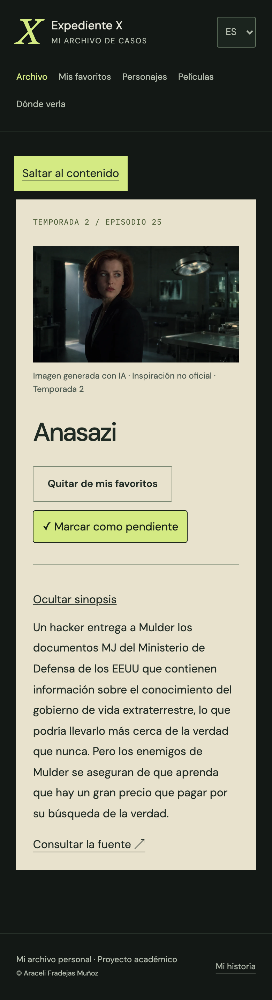

# Mis capturas de revisión · 25 de septiembre de 2026

He obtenido estas **18 capturas reales de la web publicada** en [xfiles-archive.vercel.app](https://xfiles-archive.vercel.app/), utilizando Chrome y su emulación responsive. No son maquetas ni imágenes generadas.

Indico el tamaño del área de visualización en píxeles CSS. He exportado páginas completas con una densidad de dos píxeles de imagen por píxel CSS: por eso los PNG tienen el doble de ancho y una altura que depende del contenido. No interpreto esa altura como la del dispositivo. He conservado los originales, sin recortes ni alteraciones del contenido; no contienen barras del navegador, otras pestañas ni credenciales.

Las pruebas representan móvil, tableta y escritorio **emulados**, no dispositivos físicos. He revisado visualmente los archivos exportados. La tira de temporadas permite desplazamiento horizontal dentro de su contenedor; no es un desbordamiento general de la página.

Las capturas 17 y 18 corresponden a la revisión posterior a la reorganización final de componentes y estilos. Conservo las dieciséis anteriores como registro de la revisión inicial.

## Índice de evidencias

| Captura | Idioma | Área de visualización | Archivo PNG |
| --- | --- | --- | --- |
| [Revisión final: detalle móvil](17-revision-final-anasazi-movil-es.png) | ES | 390 × 844 | 780 × 2858 |
| [Revisión final: filtro vacío](18-revision-final-vacio-tableta-es.png) | ES | 768 × 1024 | 1536 × 2048 |
| [Portada móvil](01-portada-movil-es.png) | ES | 390 × 844 | 780 × 4912 |
| [Búsqueda de Anasazi](02-busqueda-anasazi-movil-es.png) | ES | 390 × 844 | 780 × 3400 |
| [Detalle con persistencia y sinopsis](03-anasazi-persistencia-sinopsis-movil-es.png) | ES | 390 × 844 | 780 × 2856 |
| [Favoritos y progreso móvil](04-favoritos-progreso-movil-es.png) | ES | 390 × 844 | 780 × 2774 |
| [Filtro Visto en tableta](05-favoritos-vistos-tableta-es.png) | ES | 768 × 1024 | 1536 × 2348 |
| [Filtro Pendientes vacío](06-filtro-sin-resultados-tableta-es.png) | ES | 768 × 1024 | 1536 × 2048 |
| [Disponibilidad en España](07-disponibilidad-espana-tableta-es.png) | ES | 768 × 1024 | 1536 × 2224 |
| [Akte X con España seleccionada](08-aleman-pais-espana-tableta.png) | DE | 768 × 1024 | 1536 × 2096 |
| [The X-Files con Alemania seleccionada](09-ingles-pais-alemania-tableta.png) | EN | 768 × 1024 | 1536 × 2682 |
| [Portada de escritorio](10-portada-escritorio-es.png) | ES | 1440 × 900 | 2880 × 3790 |
| [Archivo de la temporada 2](11-archivo-temporada2-escritorio-es.png) | ES | 1440 × 900 | 2880 × 7884 |
| [Personajes](12-personajes-escritorio-es.png) | ES | 1440 × 900 | 2880 × 3620 |
| [Películas](13-peliculas-escritorio-es.png) | ES | 1440 × 900 | 2880 × 1800 |
| [Detalle de película](14-detalle-pelicula-escritorio-es.png) | ES | 1440 × 900 | 2880 × 1800 |
| [Mi historia y atribuciones](15-historia-atribuciones-escritorio-es.png) | ES | 1440 × 900 | 2880 × 7798 |
| [Página no encontrada](16-ruta-inexistente-escritorio-es.png) | ES | 1440 × 900 | 2880 × 1800 |

## Recorridos que he comprobado

| Comprobación | Resultado observado |
| --- | --- |
| Búsqueda de «Anasazi» | Obtengo un resultado; también encuentro el episodio usando minúsculas. Al borrar el texto recupero los 218 episodios. |
| Temporada 2 | El botón visual aplica la temporada; el selector de escritorio devuelve 25 episodios. |
| Selección aleatoria filtrada | Con «Anasazi» y temporada 2, el botón abre /expedientes/285317. Esta prueba verifica un conjunto de un resultado; no es una prueba estadística del azar. |
| Favorito y visionado | Marco Anasazi como favorito y visto. Recargo la ficha; ambos estados permanecen activos. |
| Sinopsis | Está oculta al abrir la ficha. La revelo y vuelvo a ocultarla. |
| Favoritos | Consulto la selección guardada y observo Anasazi, con progreso 1 / 218. |
| Vistos y pendientes | Visto devuelve el episodio; Pendientes devuelve cero resultados y su mensaje. |
| Retirada de datos de prueba | Desmarco visto y favorito. Tras recargar, favoritos permanece vacío y el progreso vuelve a 0 / 218. |
| Idioma independiente del país | ES/España → DE/España; recargo y conservo ambos. Después DE/Alemania → EN/Alemania → ES/Alemania. Finalmente restablezco España. |
| Disponibilidad | Observo ofertas y modalidades para España y Alemania, con fuente y fecha. No verifico reproducción, audio ni condiciones de contratación. |
| Teclado | Desde la barra de direcciones uso Tab hasta «Saltar al contenido», compruebo el foco visible, pulso Enter y Tab hasta «Abrir el archivo» y navego con Enter. Selecciono temporada 2 mediante flechas y Enter. |
| Películas | Observo las dos fichas del listado y abro la primera desde su enlace; aparece /peliculas/846 con datos reales. |
| Ruta inexistente | /ruta-de-prueba-inexistente muestra la página 404 de la interfaz. No implica un estado HTTP 404 de la SPA. |
| Diseño | Reviso las páginas capturadas a 390, 768 y 1440 píxeles de ancho. No observo contenido principal cortado en esas capturas. |

## Alcance y corrección posterior

He revisado muestras representativas de los tres tamaños y los tres idiomas, no todas las combinaciones de cada ruta, tamaño e idioma. La prueba de teclado es un recorrido concreto y no una auditoría completa de accesibilidad. No he simulado desconexión de red ni fallos de almacenamiento en esta revisión manual; el backend dispone de pruebas aisladas de errores.

Durante la revisión detecté «1 expedientes» cuando había un único resultado. Después de tomar estas capturas he corregido el contador en los tres idiomas: «1 expediente», «1 case file» y «1 Fallakte». Las capturas conservan el resultado real anterior a la corrección; no he retocado su contenido.

Las imágenes de servicios acreditan lo que muestra la aplicación. No he incorporado capturas nuevas de los paneles privados de Atlas, Cloudinary o Vercel. Las comprobaciones técnicas de la API se documentan por separado en [mi memoria](../../../MEMORIA.md).

## Galería comentada

### Portada móvil

Portada, navegación, imagen, accesos al archivo y nota personal. Idioma: **ES**. Área de visualización: **390 × 844**.

### Búsqueda de Anasazi

Un único resultado en el catálogo; estado inicial sin favorito ni visto. Idioma: **ES**. Área de visualización: **390 × 844**.

### Detalle con persistencia y sinopsis

Anasazi, temporada 2 y episodio 25, favorito y visto tras recargar; sinopsis revelada después. Idioma: **ES**. Área de visualización: **390 × 844**.

### Favoritos y progreso móvil

Anasazi aparece en favoritos; el progreso refleja 1 de 218. Idioma: **ES**. Área de visualización: **390 × 844**.

### Filtro Visto en tableta

El filtro Visto conserva el episodio marcado. Idioma: **ES**. Área de visualización: **768 × 1024**.

### Filtro Pendientes vacío

El mismo favorito queda excluido; muestro el mensaje de ausencia de resultados. Idioma: **ES**. Área de visualización: **768 × 1024**.

### Disponibilidad en España

Ofertas, modalidad, país, fuente y fecha real de consulta. Idioma: **ES**. Área de visualización: **768 × 1024**.

### Akte X con España seleccionada

Cambio a alemán y recargo; España sigue seleccionada. Idioma: **DE**. Área de visualización: **768 × 1024**.

### The X-Files con Alemania seleccionada

Cambio el país a Alemania en alemán y después la interfaz a inglés; el país se conserva. Idioma: **EN**. Área de visualización: **768 × 1024**.

### Portada de escritorio

Distribución de imagen y texto, accesos y secciones de portada. Idioma: **ES**. Área de visualización: **1440 × 900**.

### Archivo de la temporada 2

25 episodios, selector visual, filtros y cuadrícula. Idioma: **ES**. Área de visualización: **1440 × 900**.

### Personajes

Retratos, textos y atribución de las imágenes generadas con IA. Idioma: **ES**. Área de visualización: **1440 × 900**.

### Películas

Listado de las dos películas y sus enlaces. Idioma: **ES**. Área de visualización: **1440 × 900**.

### Detalle de película

Ficha abierta mediante el enlace a /peliculas/846, duración, año y sinopsis oculta. Idioma: **ES**. Área de visualización: **1440 × 900**.

### Mi historia y atribuciones

Mi motivación personal, aviso académico y créditos de TMDB y JustWatch. Idioma: **ES**. Área de visualización: **1440 × 900**.

### Página no encontrada

Mensaje 404 de la interfaz al abrir una ruta inexistente y enlace de regreso al inicio. Idioma: **ES**. Área de visualización: **1440 × 900**.

## Revisión posterior a los ajustes finales

### Anasazi en móvil

He recargado la ficha conservando favorito y visto y después he revelado la sinopsis. El enlace de salto al contenido aparece visible por el foco durante la captura. Área de visualización: **390 × 844**, idioma **ES**.

### Favoritos sin episodios pendientes

Mi único favorito está visto. Al seleccionar Pendientes obtengo cero resultados y no aparece el botón aleatorio. Área de visualización: **768 × 1024**, idioma **ES**.

